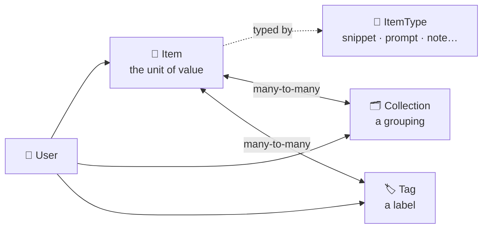
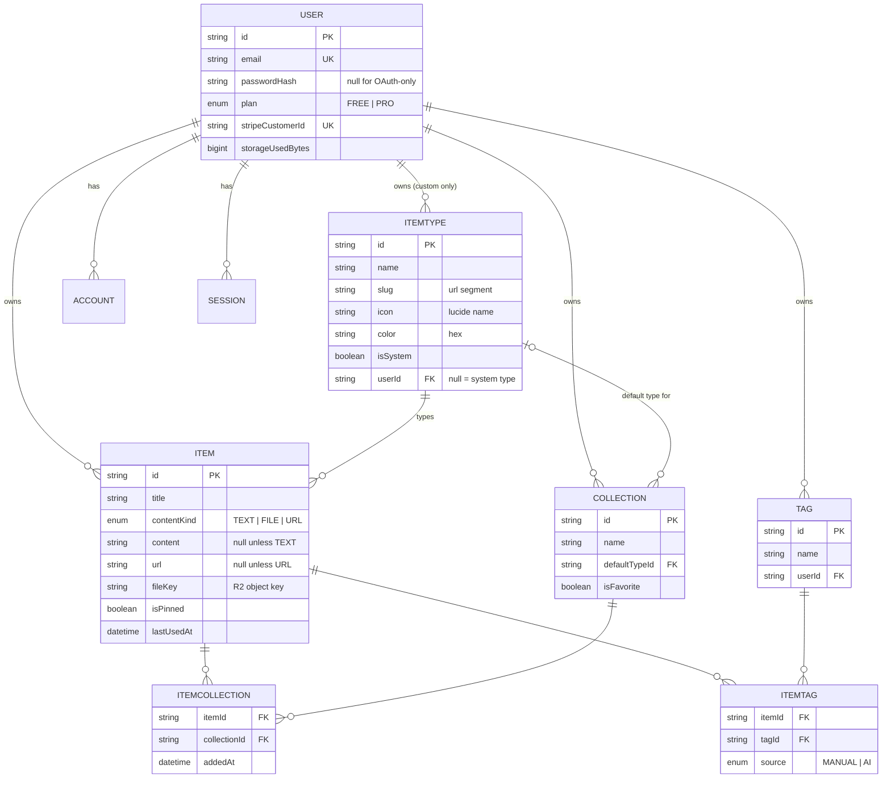
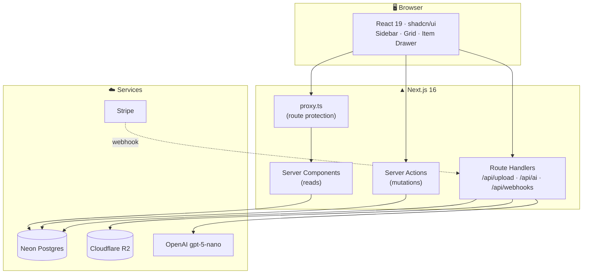
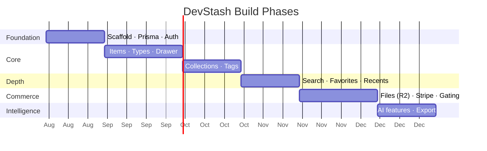

# 📦 DevStash — Project Overview

> One fast, searchable, AI-enhanced hub for everything a developer keeps scattered: snippets, prompts, commands, notes, links, and files.

| | |
|---|---|
| **Status** | Planning / pre-build |
| **Type** | Freemium SaaS |
| **Stack** | Next.js 16 · React 19 · TypeScript · Postgres (Neon) · Prisma 7 · Auth.js v5 · Tailwind v4 + shadcn/ui |
| **Last updated** | August 2026 |

---

## 1. 🎯 Problem & Positioning

Developers keep their essentials scattered across too many surfaces:

| Asset | Where it lives today | Why that hurts |
|---|---|---|
| Code snippets | VS Code, Notion | Not searchable across projects |
| AI prompts | Chat histories | Buried, never reused |
| Context files | Random project folders | Re-created from scratch every time |
| Useful links | Browser bookmarks | Untagged, unsorted |
| Docs & notes | Random folders | No shared structure |
| Commands | `.txt` files, `~/.bash_history` | Rediscovered by trial and error |
| Templates | GitHub gists | Disconnected from everything else |

**Result:** context switching, lost knowledge, inconsistent workflows.

**DevStash** consolidates all of it into one keyboard-fast, searchable hub with AI assistance on top.

### Positioning

Closest reference points are Notion (too general), GitHub Gists (snippets only), Raycast Snippets (local, macOS only), and SnippetsLab / Cacher (snippet-focused, no prompt/AI angle). DevStash's differentiator is **breadth of item type + AI-native workflow**, not raw snippet storage.

### Target Users

| Persona | Primary need | Types they lean on |
|---|---|---|
| **Everyday Developer** | Fast grab-and-paste | Snippets, commands, links |
| **AI-first Developer** | Reusable prompts, contexts, system messages | Prompts, files, notes |
| **Content Creator / Educator** | Code blocks with explanations, course material | Snippets, notes, images |
| **Full-stack Builder** | Patterns, boilerplates, API examples | Snippets, files, collections |

---

## 2. 🧩 Core Concepts

Three primitives. Everything else is built on top of them.



- **Item** — one saved thing. Always has exactly one `ItemType`.
- **ItemType** — defines behavior (text / url / file), icon, and color. Seven system types ship built-in; custom types are Pro (post-launch).
- **Collection** — a user-defined group. An item can live in many collections (a React snippet can be in both *React Patterns* and *Interview Prep*).
- **Tag** — lightweight cross-cutting label, scoped per user.

---

## 3. ✨ Features

### A. Items & Item Types

Seven **system types** ship immutable (`isSystem = true`, no user can edit or delete them):

| Type | Kind | Icon (lucide) | Color | Route | Tier |
|---|---|---|---|---|---|
| Snippet | text | `Code` | `#3b82f6` 🔵 blue | `/items/snippets` | Free |
| Prompt | text | `Sparkles` | `#8b5cf6` 🟣 purple | `/items/prompts` | Free |
| Note | text | `StickyNote` | `#fde047` 🟡 yellow | `/items/notes` | Free |
| Command | text | `Terminal` | `#f97316` 🟠 orange | `/items/commands` | Free |
| Link | url | `Link` | `#10b981` 🟢 emerald | `/items/links` | Free |
| File | file | `File` | `#6b7280` ⚫ gray | `/items/files` | **Pro** |
| Image | file | `Image` | `#ec4899` 🩷 pink | `/items/images` | **Pro** |

**Content kinds** drive the editor and the storage path:

| Kind | Editor | Stored in |
|---|---|---|
| `TEXT` | Markdown editor + syntax highlighting | `Item.content` |
| `URL` | URL input + optional metadata fetch | `Item.url` |
| `FILE` | Upload dropzone | Cloudflare R2 → `Item.fileUrl` / `fileKey` |

> **⚠️ Naming fix.** Your notes had the type as `snippet` (singular) but the route as `/items/snippets` (plural). Resolve this by giving `ItemType` an explicit **`slug`** field (`snippets`, `prompts`, …) that owns the URL, separate from the display `name` (`Snippet`). Routes then become `/items/[typeSlug]` and custom types get clean URLs for free.

Items open in a **drawer** (fast, non-navigational) rather than a full page — keeps the "grab and go" loop tight.

### B. Collections

Any item type can go in any collection. Examples: *React Patterns*, *Context Files*, *Python Snippets*, *Prototype Prompts*.

- Optional `defaultTypeId` so a new empty collection knows what to create first.
- Collection card background color is derived from the **modal item type** it contains (the most common type). Compute this in the query, don't store it — see §5.
- Favorite collections pin to the sidebar.

### C. Search

Searches across **title, content, description, tags, and type**.

Implementation is worth deciding now rather than later — see §5.3 for the Postgres full-text approach. `ILIKE '%query%'` will be fine for the first 50 items per user and will fall over the moment Pro users have thousands.

### D. Authentication

- Email + password (Credentials provider — you own the hashing)
- GitHub OAuth
- Sessions via Auth.js v5

### E. Quality-of-life Features

| Feature | Notes |
|---|---|
| Favorites | On both items and collections |
| Pin to top | Needs `pinnedAt` for stable ordering among multiple pins |
| Recently used | Needs a `lastUsedAt` field — **missing from your original data model** |
| Import code from file | Client-side read → drop into markdown editor |
| Markdown editor | For all `TEXT` types |
| File upload | `FILE` kinds only, Pro-gated |
| Export data | JSON (metadata) / ZIP (JSON + files), Pro |
| Dark mode | Default; light mode optional |
| Multi-collection management | Add/remove from many collections; item shows its memberships |

### F. AI Features (Pro)

| Feature | Model call | Cache result on |
|---|---|---|
| Auto-tag suggestions | `gpt-5-nano` | `ItemTag.source = AI` |
| Summaries | `gpt-5-nano` | `Item.aiSummary` + `aiSummaryAt` |
| Explain this code | `gpt-5-nano` | `Item.aiExplanation` |
| Prompt optimizer | `gpt-5-nano` | Not cached (interactive) |

> **💡 Cost control.** Persist every AI result on the row and only regenerate when `updatedAt > aiSummaryAt`. Without this you re-bill on every drawer open. Also add a per-user monthly AI call counter — one enthusiastic user on an $8 plan can otherwise out-spend their subscription.

---

## 4. 🗄 Data Model

### ERD



### What changed from your draft

| # | Change | Why |
|---|---|---|
| 1 | `contentType` → `contentKind` with **three** values (`TEXT`/`FILE`/`URL`) | Your notes said types can be text, url, *or* file, but the field only had two values while `url` sat as a loose column. Three-value enum makes the invariant checkable. |
| 2 | `isPro: Boolean` → `plan` + `subscriptionStatus` + `currentPeriodEnd` | A boolean can't express "canceled but paid through the 30th" or "past due, grace period." Stripe webhooks need somewhere to land. |
| 3 | Added `fileKey` alongside `fileUrl` | You cannot delete an R2 object from a public URL. Store the object key or you'll leak storage forever. |
| 4 | Added `lastUsedAt` + `useCount` | "Recently used" is in your feature list with no field to back it. |
| 5 | Added `pinnedAt` | Multiple pinned items need a deterministic order. |
| 6 | Added `slug` to `ItemType` | Resolves the singular/plural route mismatch. |
| 7 | `Tag` scoped by `userId` + `@@unique([userId, name])` | A global tag table means one user's "react" tag collides with everyone's — and leaks tag names across accounts. |
| 8 | Explicit `ItemTag` join with `source` | Lets you show "AI suggested" vs "you added" and lets users reject AI tags. |
| 9 | Added `storageUsedBytes` on User | Pro is "unlimited files" — unlimited R2 spend is a business risk, not a feature. Track it. |
| 10 | Added Auth.js adapter models + `passwordHash` | Credentials provider requires you to store the hash yourself; Auth.js won't. |
| 11 | Cascade rules on every relation | Deleting a user should not orphan 4,000 rows. |

### Prisma Schema

```prisma
// prisma/schema.prisma

generator client {
  provider = "prisma-client"            // v7: replaces "prisma-client-js"
  output   = "../src/generated/prisma"  // v7: generated code lives in src, not node_modules
}

datasource db {
  provider = "postgresql"
  url      = env("DATABASE_URL")
}

// ─── Enums ────────────────────────────────────────────────

enum ContentKind {
  TEXT
  FILE
  URL
}

enum Plan {
  FREE
  PRO
}

enum SubscriptionStatus {
  ACTIVE
  TRIALING
  PAST_DUE
  CANCELED
  INCOMPLETE
}

enum TagSource {
  MANUAL
  AI
}

// ─── Auth (Auth.js v5 adapter models) ─────────────────────

model User {
  id            String    @id @default(cuid())
  name          String?
  email         String    @unique
  emailVerified DateTime?
  image         String?
  passwordHash  String?   // null for OAuth-only accounts

  // Billing
  plan                 Plan                @default(FREE)
  stripeCustomerId     String?             @unique
  stripeSubscriptionId String?             @unique
  stripePriceId        String?
  subscriptionStatus   SubscriptionStatus?
  currentPeriodEnd     DateTime?

  // Quotas
  storageUsedBytes BigInt @default(0)
  aiCallsThisMonth Int    @default(0)
  aiQuotaResetAt   DateTime?

  accounts    Account[]
  sessions    Session[]
  items       Item[]
  itemTypes   ItemType[]
  collections Collection[]
  tags        Tag[]

  createdAt DateTime @default(now())
  updatedAt DateTime @updatedAt
}

model Account {
  id                String  @id @default(cuid())
  userId            String
  type              String
  provider          String
  providerAccountId String
  refresh_token     String?
  access_token      String?
  expires_at        Int?
  token_type        String?
  scope             String?
  id_token          String?
  session_state     String?

  user User @relation(fields: [userId], references: [id], onDelete: Cascade)

  @@unique([provider, providerAccountId])
  @@index([userId])
}

model Session {
  id           String   @id @default(cuid())
  sessionToken String   @unique
  userId       String
  expires      DateTime

  user User @relation(fields: [userId], references: [id], onDelete: Cascade)

  @@index([userId])
}

model VerificationToken {
  identifier String
  token      String   @unique
  expires    DateTime

  @@unique([identifier, token])
}

// ─── Core domain ──────────────────────────────────────────

model ItemType {
  id        String      @id @default(cuid())
  name      String                          // "Snippet"
  slug      String                          // "snippets" → /items/snippets
  icon      String                          // lucide-react icon name
  color     String                          // hex, e.g. "#3b82f6"
  kind      ContentKind @default(TEXT)
  isSystem  Boolean     @default(false)
  isProOnly Boolean     @default(false)
  sortOrder Int         @default(0)

  userId String? // null = system type, shared by all users
  user   User?   @relation(fields: [userId], references: [id], onDelete: Cascade)

  items                 Item[]
  defaultForCollections Collection[] @relation("CollectionDefaultType")

  createdAt DateTime @default(now())

  @@unique([userId, slug])
  @@index([userId])
}

model Item {
  id          String      @id @default(cuid())
  title       String
  description String?
  contentKind ContentKind @default(TEXT)

  // TEXT
  content  String? @db.Text
  language String? // "typescript", "bash" — for syntax highlighting

  // URL
  url String?

  // FILE (Cloudflare R2)
  fileUrl  String?
  fileKey  String? // object key — required to delete from R2
  fileName String?
  fileSize Int?
  mimeType String?

  // State
  isFavorite Boolean   @default(false)
  isPinned   Boolean   @default(false)
  pinnedAt   DateTime?
  lastUsedAt DateTime?
  useCount   Int       @default(0)

  // Cached AI output (regenerate only when updatedAt > *At)
  aiSummary     String?   @db.Text
  aiSummaryAt   DateTime?
  aiExplanation String?   @db.Text
  aiExplainedAt DateTime?

  userId     String
  user       User     @relation(fields: [userId], references: [id], onDelete: Cascade)
  itemTypeId String
  itemType   ItemType @relation(fields: [itemTypeId], references: [id], onDelete: Restrict)

  collections ItemCollection[]
  tags        ItemTag[]

  createdAt DateTime @default(now())
  updatedAt DateTime @updatedAt

  @@index([userId, createdAt(sort: Desc)])
  @@index([userId, itemTypeId])
  @@index([userId, lastUsedAt(sort: Desc)])
  @@index([userId, isPinned, pinnedAt(sort: Desc)])
  @@index([userId, isFavorite])
}

model Collection {
  id          String  @id @default(cuid())
  name        String
  slug        String
  description String?
  isFavorite  Boolean @default(false)

  defaultTypeId String?
  defaultType   ItemType? @relation("CollectionDefaultType", fields: [defaultTypeId], references: [id], onDelete: SetNull)

  userId String
  user   User   @relation(fields: [userId], references: [id], onDelete: Cascade)

  items ItemCollection[]

  createdAt DateTime @default(now())
  updatedAt DateTime @updatedAt

  @@unique([userId, slug])
  @@index([userId, updatedAt(sort: Desc)])
}

model ItemCollection {
  itemId       String
  collectionId String
  addedAt      DateTime @default(now())

  item       Item       @relation(fields: [itemId], references: [id], onDelete: Cascade)
  collection Collection @relation(fields: [collectionId], references: [id], onDelete: Cascade)

  @@id([itemId, collectionId])
  @@index([collectionId, addedAt(sort: Desc)])
  @@index([itemId])
}

model Tag {
  id   String @id @default(cuid())
  name String

  userId String
  user   User   @relation(fields: [userId], references: [id], onDelete: Cascade)

  items ItemTag[]

  createdAt DateTime @default(now())

  @@unique([userId, name])
  @@index([userId])
}

model ItemTag {
  itemId String
  tagId  String
  source TagSource @default(MANUAL)

  item Item @relation(fields: [itemId], references: [id], onDelete: Cascade)
  tag  Tag  @relation(fields: [tagId], references: [id], onDelete: Cascade)

  @@id([itemId, tagId])
  @@index([tagId])
}
```

### 🚨 Postgres gotcha: unique constraints with NULL

`@@unique([userId, slug])` on `ItemType` **will not** prevent duplicate system types, because Postgres treats `NULL` values as distinct — you could insert `(null, "snippets")` twice. Add a partial unique index in a hand-written migration:

```sql
CREATE UNIQUE INDEX "ItemType_system_slug_key"
  ON "ItemType" ("slug")
  WHERE "userId" IS NULL;
```

---

## 5. 🔍 Implementation Notes

### 5.1 Collection card color

The card background is "the color of the type this collection holds the most of." Don't denormalize it — it changes on every add/remove. Compute per query:

```sql
SELECT c.id, t."color", COUNT(*) AS n
FROM "Collection" c
JOIN "ItemCollection" ic ON ic."collectionId" = c.id
JOIN "Item" i          ON i.id = ic."itemId"
JOIN "ItemType" t      ON t.id = i."itemTypeId"
WHERE c."userId" = $1
GROUP BY c.id, t."color"
ORDER BY c.id, n DESC;
```

Take the first row per collection; fall back to `defaultType.color`, then neutral gray for empty collections.

### 5.2 Plan gating

Derive entitlements in one place, never scatter `user.plan === 'PRO'` through the codebase:

```ts
// src/lib/entitlements.ts
export const LIMITS = {
  FREE: { items: 50, collections: 3, storageBytes: 0,        ai: false, files: false },
  PRO:  { items: Infinity, collections: Infinity, storageBytes: 5 * 1024 ** 3, ai: true, files: true },
} as const;

// During development: flip this to unlock everything for all users.
export const DEV_UNLOCK_ALL = process.env.NEXT_PUBLIC_DEV_UNLOCK_ALL === "true";
```

> **⚠️ Business flag.** "Unlimited file uploads" on an $8/month plan is an unbounded cost. R2 has no egress fees but does charge for storage. Cap Pro at something generous (5 GB) and say so on the pricing page — the `storageUsedBytes` field above supports this.

### 5.3 Search

Start with Postgres full-text search — no extra infrastructure, good enough well past product-market fit. Add a generated column in a migration:

```sql
ALTER TABLE "Item" ADD COLUMN "searchVector" tsvector
  GENERATED ALWAYS AS (
    setweight(to_tsvector('english', coalesce("title", '')), 'A') ||
    setweight(to_tsvector('english', coalesce("description", '')), 'B') ||
    setweight(to_tsvector('english', coalesce("content", '')), 'C')
  ) STORED;

CREATE INDEX "Item_search_idx" ON "Item" USING GIN ("searchVector");

-- fuzzy / typo-tolerant title matching
CREATE EXTENSION IF NOT EXISTS pg_trgm;
CREATE INDEX "Item_title_trgm_idx" ON "Item" USING GIN ("title" gin_trgm_ops);
```

Then expose it to Prisma as an untracked column:

```prisma
model Item {
  // ...
  searchVector Unsupported("tsvector")?
}
```

Query with `$queryRaw` and always scope by `userId` first. **Tags are not in the vector** — either join `ItemTag` in the same query, or denormalize a `tagsText` column maintained by a trigger. Decide before you build the search UI.

### 5.4 Caching (Redis — "maybe")

Skip it for v1. Next.js 16's `use cache` directive plus Postgres indexes will carry you a long way, and Redis is one more thing to pay for and page on. Revisit when a real query shows up slow in production.

---

## 6. 🛠 Tech Stack

| Layer | Choice | Docs |
|---|---|---|
| Framework | Next.js 16 (App Router, Turbopack) | [nextjs.org/docs](https://nextjs.org/docs) |
| UI | React 19 + Server Components | [react.dev](https://react.dev) |
| Language | TypeScript (strict) | [typescriptlang.org](https://www.typescriptlang.org/docs/) |
| Styling | Tailwind CSS v4 + shadcn/ui | [tailwindcss.com](https://tailwindcss.com/docs) · [ui.shadcn.com](https://ui.shadcn.com) |
| Icons | lucide-react | [lucide.dev/icons](https://lucide.dev/icons) |
| Database | Neon Postgres | [neon.com/docs](https://neon.com/docs) |
| ORM | Prisma 7 | [prisma.io/docs](https://www.prisma.io/docs) |
| Auth | Auth.js v5 (`next-auth`) | [authjs.dev](https://authjs.dev) |
| Files | Cloudflare R2 | [developers.cloudflare.com/r2](https://developers.cloudflare.com/r2/) |
| Payments | Stripe | [docs.stripe.com/billing](https://docs.stripe.com/billing) |
| AI | OpenAI `gpt-5-nano` | [platform.openai.com/docs](https://platform.openai.com/docs) |

### Architecture



### ⚠️ Version-specific gotchas

Three things in your notes have moved since they were written. Each will cost you an afternoon if you find them at build time.

**Prisma 7** ([upgrade guide](https://www.prisma.io/docs/guides/upgrade-prisma-orm/v7) · [changelog](https://www.prisma.io/changelog))
- The Rust query engine is gone — the client is now pure TypeScript/WASM.
- `prisma.config.ts` is now **required** for migrations and introspection.
- The generator provider is `prisma-client`, not `prisma-client-js`, and generated code goes to a path you specify in `src/`, not `node_modules`. Add it to `.gitignore` and run `prisma generate` in your build step.
- You need a **driver adapter** for Neon: `@prisma/adapter-neon` (serverless driver) or `@prisma/adapter-pg`.
- Connection-pool sizing heuristics changed in v7. Watch for saturation under load.

**Next.js 16** ([release notes](https://nextjs.org/blog/next-16))
- `middleware.ts` is renamed to **`proxy.ts`** and must export a function named `proxy` (or a default export). Most Auth.js tutorials still show `middleware.ts`.
- Turbopack is the default bundler.
- Caching is explicit and opt-in via `use cache`.

**Auth.js v5** ([migration guide](https://authjs.dev/getting-started/migrating-to-v5))
- Env vars use the `AUTH_` prefix (`AUTH_SECRET`, `AUTH_GITHUB_ID`), not `NEXTAUTH_`.
- **Split your config**: `auth.config.ts` (edge-safe, providers + callbacks only) is what `proxy.ts` imports; `auth.ts` (with the Prisma adapter) is what your server code imports. Importing `auth.ts` in the proxy pulls Prisma into the edge runtime and breaks the build.
- Credentials provider does **not** hash passwords for you. Use `bcrypt` or `argon2` yourself.
- Peer-dependency ranges may not list Next.js 16 yet; you may need `--legacy-peer-deps`.
- Worth knowing: Auth.js has been in maintenance mode since early 2026 (Better Auth now maintains it). It's stable and fine for v1, but if auth requirements grow — organizations, 2FA, passkeys — evaluate **Better Auth** before you're deeply committed.

### 🔒 Migration policy (non-negotiable)

> **NEVER** use `prisma db push` or edit the database structure by hand.

```bash
# Development — creates a migration file, applies it locally
npx prisma migrate dev --name add_item_search_vector

# Production — applies committed migrations only
npx prisma migrate deploy
```

Every schema change is a committed migration file, reviewed like code. Raw SQL (the tsvector column, the partial unique index) goes into migration files via `prisma migrate dev --create-only`, then edit before applying.

### Environment Variables

| Variable | Purpose |
|---|---|
| `DATABASE_URL` | Neon pooled connection |
| `DIRECT_URL` | Neon direct connection — **required for migrations** |
| `AUTH_SECRET` | Auth.js signing key (`openssl rand -base64 32`) |
| `AUTH_GITHUB_ID` / `AUTH_GITHUB_SECRET` | GitHub OAuth app |
| `R2_ACCOUNT_ID` / `R2_ACCESS_KEY_ID` / `R2_SECRET_ACCESS_KEY` / `R2_BUCKET` | Cloudflare R2 |
| `R2_PUBLIC_URL` | Public bucket / custom domain base URL |
| `OPENAI_API_KEY` | AI features |
| `STRIPE_SECRET_KEY` / `STRIPE_WEBHOOK_SECRET` | Payments |
| `STRIPE_PRICE_MONTHLY` / `STRIPE_PRICE_YEARLY` | Price IDs |
| `NEXT_PUBLIC_DEV_UNLOCK_ALL` | Dev-only: bypass plan gating |

---

## 7. 💰 Monetization

Freemium.

| | **Free** | **Pro — $8/mo or $72/yr** |
|---|---|---|
| Items | 50 | Unlimited |
| Collections | 3 | Unlimited |
| System types | All except File & Image | All |
| File & image uploads | ❌ | ✅ (5 GB cap recommended) |
| Search | Basic | Full |
| AI auto-tagging | ❌ | ✅ |
| AI summaries & explain | ❌ | ✅ |
| Prompt optimizer | ❌ | ✅ |
| Custom types | ❌ | ✅ *(post-launch)* |
| Export (JSON/ZIP) | ❌ | ✅ |
| Support | Community | Priority |

Annual saves 25% ($96 → $72).

**During development, all users get everything.** Build the gating layer (§5.2) from day one, but leave `DEV_UNLOCK_ALL=true` until launch — retrofitting entitlement checks into a finished app is painful.

### Open questions

- What happens when a Pro user downgrades with 400 items and 12 collections? Options: read-only over the limit, or a 30-day grace period then lock. **Decide before launch** — it affects the UI everywhere.
- Same for files: does R2 content get deleted, or frozen and hidden?

---

## 8. 🎨 UI/UX

**Direction:** modern, minimal, developer-focused. References: **Notion** (structure), **Linear** (density and speed), **Raycast** (command-first interaction).

- Dark mode default, light mode optional
- Clean typography, generous whitespace
- Subtle borders and shadows
- Syntax highlighting on all code blocks

### Layout

```
┌────────────────┬──────────────────────────────────────────┐
│  DevStash      │  🔍 Search…                        ⌘K    │
├────────────────┼──────────────────────────────────────────┤
│  ITEM TYPES    │  Collections                             │
│  ▸ Snippets    │  ┌──────────┐ ┌──────────┐ ┌──────────┐  │
│  ▸ Prompts     │  │ React    │ │ Context  │ │ Python   │  │
│  ▸ Notes       │  │ Patterns │ │ Files    │ │ Snippets │  │
│  ▸ Commands    │  │ 🔵 12    │ │ ⚫ 4     │ │ 🔵 27    │  │
│  ▸ Links       │  └──────────┘ └──────────┘ └──────────┘  │
│  ▸ Files       │                                          │
│  ▸ Images      │  Recent Items                            │
│                │  ┌────────────────────────────────────┐  │
│  COLLECTIONS   │  │🔵 useDebounce hook      typescript │  │
│  ★ React …     │  ├────────────────────────────────────┤  │
│  ★ Prompts     │  │🟣 Code review prompt               │  │
│                │  ├────────────────────────────────────┤  │
│  [collapse ◀]  │  │🟠 docker prune all                 │  │
└────────────────┴──────────────────────────────────────────┘
                    ↑ click any item → drawer slides in from right
```

- **Sidebar:** item types (links to `/items/[typeSlug]`), then favorite/recent collections. Collapsible.
- **Main:** grid of collection cards — **background** color = modal item type. Items render below in cards with a colored **border**.
- **Drawer:** every item opens here. Fast in, fast out, no page navigation.

### Responsive

Desktop-first, mobile usable. Sidebar becomes a drawer under `md`. The item drawer becomes a bottom sheet on mobile.

### Micro-interactions

- Smooth transitions on drawer open/close
- Hover states on all cards
- Toast notifications for every mutation (copy, save, delete, add-to-collection)
- Loading skeletons matching final layout dimensions (no layout shift)

> **♿ Accessibility note.** Note yellow `#fde047` has poor contrast on light backgrounds — roughly 1.5:1 against white. It's fine as a *border* or as a dot on dark, but never use it for text or as a card background in light mode. Consider `#ca8a04` (yellow-600) as the light-mode variant. Define each type color as a CSS variable pair (`--type-note` / `--type-note-fg`) so light mode can diverge.

---

## 9. 🗺 Build Roadmap



| Phase | Ships | Done when |
|---|---|---|
| **1 · Foundation** | Next.js 16 scaffold, Prisma 7 + Neon, migrations, Auth.js (email + GitHub), layout shell, dark mode | A user can sign up, sign in, and see an empty dashboard |
| **2 · Core** | Item CRUD, seeded system types, markdown editor, syntax highlighting, item drawer, type-filtered routes | A user can create and retrieve a snippet in under 5 seconds |
| **3 · Organize** | Collections CRUD, multi-collection membership, tags, collection cards with derived colors | An item can live in two collections and both show it |
| **4 · Find** | Full-text search, favorites, pinning, recently used, keyboard shortcuts (⌘K) | Search returns useful results across 500 seeded items |
| **5 · Monetize** | R2 uploads, Stripe checkout + webhooks + portal, entitlement enforcement, quota UI | A test card upgrades an account and unlocks file upload |
| **6 · AI** | Auto-tagging, summaries, explain code, prompt optimizer, JSON/ZIP export | AI results are cached and don't re-bill on re-open |

**Explicitly deferred:** custom item types, team/shared collections, browser extension, VS Code extension, public snippet sharing, API access.

---

## 10. ❓ Decisions Still Open

1. **Downgrade behavior** — what happens to over-limit items and files? (§7)
2. **Are tags searchable in the same query as content?** Determines whether you need a denormalized `tagsText` column. (§5.3)
3. **Does the free tier get *any* AI?** A 5-calls-per-month taste is a strong upgrade driver; zero is a cleaner story.
4. **Public sharing** — a shareable read-only snippet URL is the single cheapest growth loop available. Worth a `shareToken` field even if the feature ships later.
5. **Link metadata** — do you fetch title/favicon/OG image on save? Nice UX, but adds a scraping path and failure modes.
6. **Soft delete / trash** — losing a snippet to a mis-click is the kind of thing that ends a subscription. A `deletedAt` column is nearly free to add now and expensive to retrofit.
